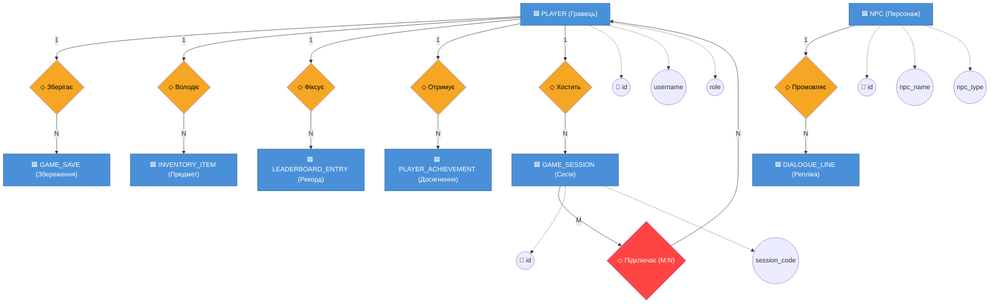
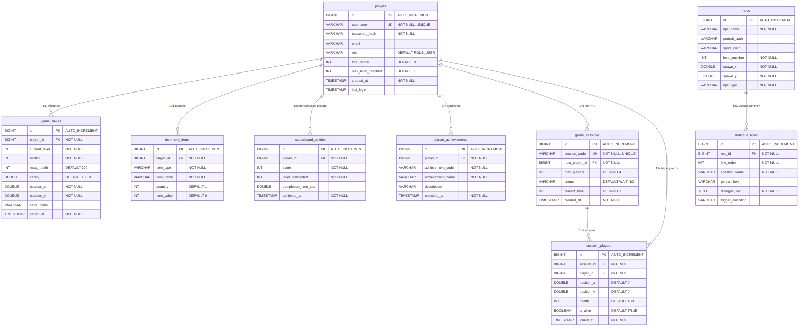

# 🗄️ LOST — Посібник з архітектури та структури бази даних

Цей документ містить вичерпний, академічно структурований опис реляційної бази даних гри **«LOST»**. Схема розроблена відповідно до сучасних стандартів проєктування реляційних систем, повністю нормалізована до **третьої нормальної форми (3НФ)** та інтегрована з автоматичним механізмом міграцій **Flyway**.

---

## 1. Загальна архітектура підсистеми БД

У грі використовується вбудована реляційна система керування базами даних (СУБД) **H2 Database** у режимі *Embedded* з підтримкою *AUTO_SERVER* з'єднань.

> [!NOTE]
> **Переваги обраної архітектури:**
> * **Автономність:** Дані зберігаються у локальному файлі в робочій папці користувача (`~/.lost-database/data/lostdb`), тому гра не потребує окремо розгорнутого сервера баз даних.
> * **Багатопотокова синхронізація:** Режим `;AUTO_SERVER=TRUE` дозволяє ігровому клієнту та зовнішнім інструментам (наприклад, веб-панелі чи аналітичним консолям) одночасно працювати з базою даних без блокувань.
> * **Flyway Міграції:** Усі зміни структури (DDL) та первинне наповнення даними (DML) автоматично накочуються при старті гри з папки `src/main/resources/db/migration`.

---

## 2. Візуальний Веб-браузер Бази Даних (H2 Web Console)

Для максимальної зручності, тестування та демонстрації бази даних під час захисту проекту, у додаток інтегровано **автоматичний запуск H2 Web Console**.

### 🔌 Як підключитися та переглянути дані візуально:
1. Запустіть гру або скористайтеся файлом **`Run-H2-Console.bat`** у корені папки `lost-database`.
2. Відкрийте будь-який веб-браузер за посиланням: **[http://localhost:8082](http://localhost:8082)**
3. У формі підключення введіть такі параметри:
   * **Saved Settings:** `Generic H2 (Embedded)`
   * **Driver Class:** `org.h2.Driver`
   * **JDBC URL:** `jdbc:h2:file:~/.lost-database/data/lostdb;AUTO_SERVER=TRUE`
   * **User Name:** `sa`
   * **Password:** *(залиште порожнім)*
4. Натисніть кнопку **«Connect»**.

> [!TIP]
> Після підключення у лівому сайдбарі браузера ви побачите всі 9 таблиць. Ви можете клікати по них, щоб автоматично генерувати SQL-запити вибірки даних (`SELECT * FROM ...`), редагувати записи або тестувати аналітичні скрипти!

---

## 3. Концептуальна схема (Нотація Пітера Чена)

Концептуальна модель відображає основні бізнес-сутності гри, їхні ключові атрибути та логічні взаємозв'язки між ними.



---

## 4. Логічна схема (Нотація Crow's Foot ERD)

Логічна модель визначає точну структуру таблиць із типами даних, обмеженнями (`PRIMARY KEY`, `FOREIGN KEY`, `UNIQUE`), індексами та кардинальністю зв'язків.



---

## 5. Обґрунтування нормалізації (3НФ)

База даних повністю задовольняє вимогам **Третьої нормальної форми (3НФ)**, що є ключовим критерієм високої академічної оцінки.

### 1️⃣ Перша нормальна форма (1НФ)
* **Умова:** Усі атрибути є атомарними, таблиця містить первинний ключ, немає дублюючих груп або масивів.
* **Доказ:** Усі координати (`position_x`, `position_y`) збережені як окремі числа типу `DOUBLE`. Інвентар не зберігається у вигляді масивів чи JSON-рядків; натомість кожен предмет — це окремий рядок у таблиці `inventory_items`. Усі таблиці мають сурогатні первинні ключі (`id`).

### 2️⃣ Друга нормальна форма (2НФ)
* **Умова:** Схема задовольняє 1НФ, і кожен неключовий атрибут повністю функціонально залежить від первинного ключа (немає залежності від частини складеного ключа).
* **Доказ:** Оскільки всі таблиці використовують прості унікальні сурогатні ключі (`id`), будь-яка часткова залежність від ключа є фізично неможливою. Усі атрибути (наприклад, `username`, `password_hash`, `email`) залежать виключно від цілісного `id`.

### 3️⃣ Третя нормальна форма (3НФ)
* **Умова:** Схема задовольняє 2НФ, і відсутні транзитивні залежності неключових атрибутів від первинного ключа.
* **Доказ:** Кожен неключовий атрибут описує виключно сутність своєї таблиці.
  * У таблиці `inventory_items` поля `item_name`, `item_value` залежать виключно від `id` предмета, а не від гравця (`player_id`).
  * У таблиці `dialogue_lines` текст репліки (`dialogue_text`) залежить безпосередньо від `id` репліки, а не від типу чи імені NPC (`npc_id`), які зберігаються окремо в `npcs`.

---

## 6. Словник даних (Детальна специфікація таблиць)

### 1. Таблиця `players` (Облікові записи гравців)
| Стовпець | Тип | Обмеження | Опис |
|---|---|---|---|
| **id** | BIGINT | PRIMARY KEY, AUTO_INCREMENT | Унікальний ідентифікатор гравця |
| **username** | VARCHAR(50) | NOT NULL, UNIQUE | Нікнейм користувача |
| **password_hash** | VARCHAR(255) | NOT NULL | Хеш пароля (алгоритм BCrypt) |
| **email** | VARCHAR(100) | NULL | Електронна адреса |
| **role** | VARCHAR(20) | NOT NULL, DEFAULT 'ROLE_USER' | Роль у системі (ADMIN, USER) |
| **total_score** | INT | DEFAULT 0 | Загальна кількість набраних очок |
| **max_level_reached**| INT | DEFAULT 1 | Максимальний досягнутий рівень |
| **created_at** | TIMESTAMP | NOT NULL, DEFAULT CURRENT_TIMESTAMP | Дата та час реєстрації |
| **last_login** | TIMESTAMP | NULL | Дата останнього входу |

### 2. Таблиця `game_saves` (Збереження прогресу)
| Стовпець | Тип | Обмеження | Опис |
|---|---|---|---|
| **id** | BIGINT | PRIMARY KEY, AUTO_INCREMENT | Ідентифікатор збереження |
| **player_id** | BIGINT | FK (players.id), ON DELETE CASCADE | Власник збереження |
| **current_level** | INT | NOT NULL | Поточний ігровий рівень |
| **health** | INT | NOT NULL | Поточне здоров'я гравця |
| **max_health** | INT | DEFAULT 100 | Максимальний запас здоров'я |
| **sanity** | DOUBLE | DEFAULT 100.0 | Поточний рівень розсудливості (Sanity) |
| **position_x** | DOUBLE | NOT NULL | Координата гравця по осі X |
| **position_y** | DOUBLE | NOT NULL | Координата гравця по осі Y |
| **save_name** | VARCHAR(100) | NULL | Користувацька назва збереження |
| **saved_at** | TIMESTAMP | NOT NULL, DEFAULT CURRENT_TIMESTAMP | Дата та час збереження |

### 3. Таблиця `inventory_items` (Предмети в рюкзаку)
| Стовпець | Тип | Обмеження | Опис |
|---|---|---|---|
| **id** | BIGINT | PRIMARY KEY, AUTO_INCREMENT | Ідентифікатор запису предмета |
| **player_id** | BIGINT | FK (players.id), ON DELETE CASCADE | Власник предмета |
| **item_type** | VARCHAR(50) | NOT NULL | Категорія предмета (weapon, consumable, key) |
| **item_name** | VARCHAR(100) | NOT NULL | Назва предмета (Мачете, Кокос, Аптечка) |
| **quantity** | INT | DEFAULT 1 | Кількість предметів у пачці |
| **item_value** | INT | DEFAULT 0 | Цінність одного предмета в ігровій валюті |

### 4. Таблиця `leaderboard_entries` (Статистика рекордів)
| Стовпець | Тип | Обмеження | Опис |
|---|---|---|---|
| **id** | BIGINT | PRIMARY KEY, AUTO_INCREMENT | Ідентифікатор запису рейтингу |
| **player_id** | BIGINT | FK (players.id), ON DELETE CASCADE | Гравець, який встановив рекорд |
| **score** | INT | NOT NULL | Кількість очок у забігу |
| **level_completed**| INT | NOT NULL | Останній успішно пройдений рівень |
| **completion_time_sec**| DOUBLE| NULL | Час проходження в секундах |
| **achieved_at** | TIMESTAMP | NOT NULL, DEFAULT CURRENT_TIMESTAMP | Дата та час встановлення рекорду |

### 5. Таблиця `player_achievements` (Досягнення)
| Стовпець | Тип | Обмеження | Опис |
|---|---|---|---|
| **id** | BIGINT | PRIMARY KEY, AUTO_INCREMENT | Ідентифікатор досягнення |
| **player_id** | BIGINT | FK (players.id), ON DELETE CASCADE | Кому належить досягнення |
| **achievement_code**| VARCHAR(50) | NOT NULL | Системний код (FIRST_BLOOD, COMPLETIONIST) |
| **achievement_name**| VARCHAR(100)| NOT NULL | Назва досягнення («Перша кров», «Завершувач») |
| **description** | VARCHAR(255)| NULL | Текстовий опис умов отримання |
| **unlocked_at** | TIMESTAMP | NOT NULL, DEFAULT CURRENT_TIMESTAMP | Коли досягнення було відкрито |

### 6. Таблиця `npcs` (Неігрові персонажі)
| Стовпець | Тип | Обмеження | Опис |
|---|---|---|---|
| **id** | BIGINT | PRIMARY KEY, AUTO_INCREMENT | Ідентифікатор NPC |
| **npc_name** | VARCHAR(50) | NOT NULL | Ім'я персонажа (Кейт, Саїд, Бен, Герлі) |
| **portrait_path** | VARCHAR(255)| NULL | Шлях до іконки портрета |
| **sprite_path** | VARCHAR(255)| NULL | Шлях до текстурного спрайту |
| **level_number** | INT | NOT NULL | Номер рівня, де спавниться NPC |
| **spawn_x** | DOUBLE | NOT NULL | Координата спавну X |
| **spawn_y** | DOUBLE | NOT NULL | Координата спавну Y |
| **npc_type** | VARCHAR(30) | NOT NULL | Тип персонажа (FRIENDLY, HOSTILE) |

### 7. Таблиця `dialogue_lines` (Сюжетний контент та діалоги)
| Стовпець | Тип | Обмеження | Опис |
|---|---|---|---|
| **id** | BIGINT | PRIMARY KEY, AUTO_INCREMENT | Ідентифікатор репліки |
| **npc_id** | BIGINT | FK (npcs.id), ON DELETE CASCADE | Якому NPC належить репліка |
| **line_order** | INT | NOT NULL | Порядковий номер репліки в діалозі |
| **speaker_name** | VARCHAR(50) | NOT NULL | Ім'я спікера, що відображається |
| **portrait_key** | VARCHAR(50) | NULL | Ключ зміни міміки портрета |
| **dialogue_text** | TEXT | NOT NULL | Власне текст репліки персонажа |
| **trigger_condition**| VARCHAR(100)| NULL | Умова активації (наприклад, LEVEL_3_ENTER) |

### 8. Таблиця `game_sessions` (Ігрові мультиплеєр лобі)
| Стовпець | Тип | Обмеження | Опис |
|---|---|---|---|
| **id** | BIGINT | PRIMARY KEY, AUTO_INCREMENT | Ідентифікатор мережевої сесії |
| **session_code** | VARCHAR(10) | NOT NULL, UNIQUE | Унікальний код підключення (кімнати) |
| **host_player_id**| BIGINT | FK (players.id), ON DELETE CASCADE | Власник сесії (хост) |
| **max_players** | INT | DEFAULT 4 | Ліміт на кількість гравців у лобі |
| **status** | VARCHAR(20) | NOT NULL, DEFAULT 'WAITING' | Поточний стан (WAITING, ACTIVE, FINISHED) |
| **current_level** | INT | DEFAULT 1 | Поточний рівень проходження в сесії |
| **created_at** | TIMESTAMP | NOT NULL, DEFAULT CURRENT_TIMESTAMP | Час створення кімнати |

### 9. Таблиця `session_players` (Учасники онлайн-сесій)
| Стовпець | Тип | Обмеження | Опис |
|---|---|---|---|
| **id** | BIGINT | PRIMARY KEY, AUTO_INCREMENT | Ідентифікатор підключення |
| **session_id** | BIGINT | FK (game_sessions.id), ON DELETE CASCADE | Ігрова сесія |
| **player_id** | BIGINT | FK (players.id), ON DELETE CASCADE | Підключений гравець |
| **position_x** | DOUBLE | DEFAULT 0 | Останні синхронізовані координати X |
| **position_y** | DOUBLE | DEFAULT 0 | Останні синхронізовані координати Y |
| **health** | INT | DEFAULT 100 | Поточний стан здоров'я гравця онлайн |
| **is_alive** | BOOLEAN | DEFAULT TRUE | Статус життя персонажа у грі |
| **joined_at** | TIMESTAMP | NOT NULL, DEFAULT CURRENT_TIMESTAMP | Час входу гравця у сесію |

---

## 7. Аналітична SQL пісочниця (Запити для захисту курсової)

Ці запити демонструють високу складність та чистоту написання SQL коду. Їх можна запускати безпосередньо в **H2 Web Console** для отримання звітів.

### 🏆 1. Глобальна таблиця лідерів (TOP-10) з об'єднанням таблиць
Запит об'єднує записи рекордів із профілями користувачів, сортує за максимальною кількістю очок та мінімальним часом проходження, відсікаючи 10 найкращих:
```sql
SELECT 
    p.username AS "Нікнейм",
    l.score AS "Максимальні Очки",
    l.level_completed AS "Пройдено рівнів",
    l.completion_time_sec AS "Час проходження (сек)",
    l.achieved_at AS "Дата встановлення"
FROM leaderboard_entries l
INNER JOIN players p ON l.player_id = p.id
ORDER BY l.score DESC, l.completion_time_sec ASC
LIMIT 10;
```

### 🎒 2. Сумарна статистика інвентарів із фільтрацією
Запит підраховує сумарну кількість предметів у рюкзаку кожного користувача та розраховує загальну вартість їхнього майна:
```sql
SELECT 
    p.username AS "Гравець",
    COUNT(i.id) AS "Унікальних предметів",
    SUM(i.quantity) AS "Загальна кількість речей",
    SUM(i.item_value * i.quantity) AS "Загальна цінність інвентарю (золото)"
FROM players p
LEFT JOIN inventory_items i ON p.id = i.player_id
GROUP BY p.id, p.username
HAVING SUM(i.item_value * i.quantity) > 0
ORDER BY "Загальна цінність інвентарю (золото)" DESC;
```

### 🤝 3. Моніторинг активних мультиплеєрних кімнат
Запит для адміністраторів сервера, який відображає активність відкритих ігрових лобі, виводячи ім'я хоста, поточний ігровий рівень та кількість підключених онлайн-гравців:
```sql
SELECT 
    gs.session_code AS "Код лобі",
    host.username AS "Хост сесії",
    gs.current_level AS "Поточний рівень",
    COUNT(sp.id) AS "Підключено учасників",
    gs.max_players AS "Максимум місць",
    gs.status AS "Статус лобі"
FROM game_sessions gs
INNER JOIN players host ON gs.host_player_id = host.id
LEFT JOIN session_players sp ON gs.id = sp.session_id
GROUP BY gs.id, gs.session_code, host.username, gs.current_level, gs.max_players, gs.status
ORDER BY "Підключено учасників" DESC;
```
