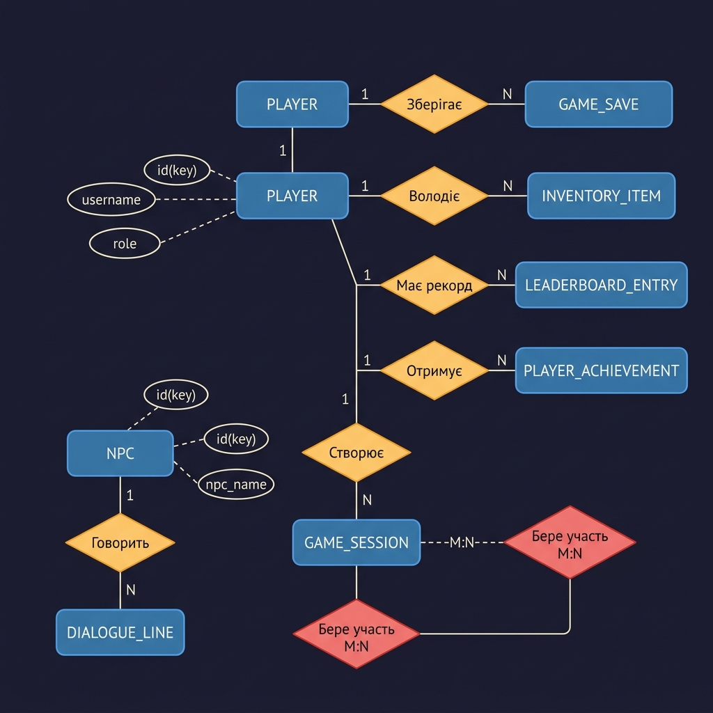
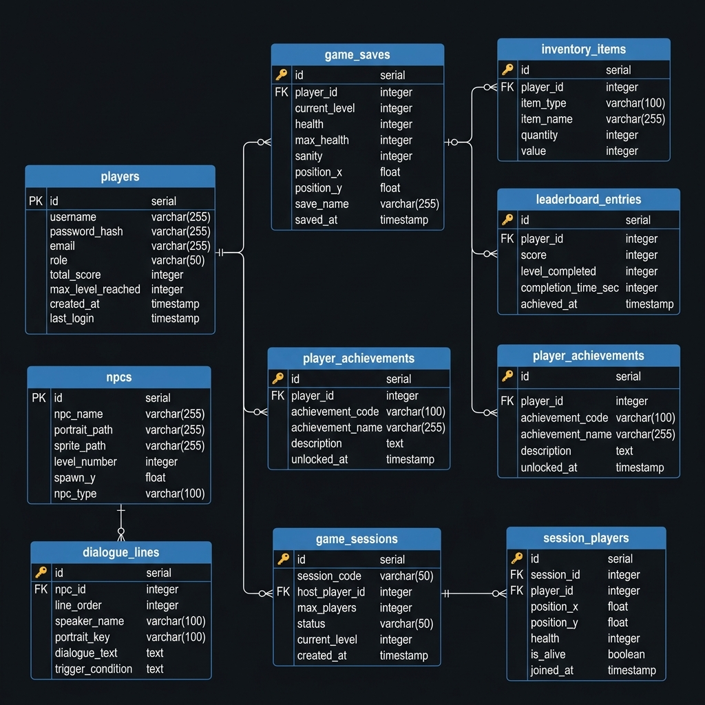

# Lost Game - Database Design

Концептуальна та логічна схема бази даних для гри "Lost".

## 📊 Діаграми

### Концептуальна схема (нотація Пітера Чена)



### Логічна схема (нотація Crow's Foot)



## 🗂️ Структура проєкту

```
├── Assets/Images/         # Зображення діаграм
│   ├── conceptual_schema.png
│   └── logical_schema.png
├── example/               # Приклади запитів
│   └── queries.sql
├── DDL.sql                # Структура БД (CREATE TABLE)
├── DML.sql                # Тестові дані (INSERT)
└── README.md              # Цей файл
```

## 🏗️ Сутності (9 таблиць)

| # | Таблиця | Тип | НФ | Опис |
|---|---------|-----|----|------|
| 1 | `players` | Довідкова | 3НФ | Гравці (логін, пароль, роль) |
| 2 | `game_saves` | Робоча | 3НФ | Збереження гри |
| 3 | `inventory_items` | Робоча | 3НФ | Інвентар гравця |
| 4 | `leaderboard_entries` | Робоча | 3НФ | Таблиця лідерів |
| 5 | `player_achievements` | Робоча | 3НФ | Досягнення |
| 6 | `npcs` | Довідкова | 3НФ | Неігрові персонажі |
| 7 | `dialogue_lines` | Довідкова | 3НФ | Репліки діалогів NPC |
| 8 | `game_sessions` | Робоча | 3НФ | Ігрові сесії (мультиплеєр) |
| 9 | `session_players` | Зв'язувальна | 3НФ | Гравці у сесіях (M:N) |

## 🔗 Типи зв'язків

| Зв'язок | Тип | Реалізація |
|---------|-----|------------|
| Player → GameSaves | **1:N** | FK `player_id` |
| Player → InventoryItems | **1:N** | FK `player_id` |
| Player → LeaderboardEntries | **1:N** | FK `player_id` |
| Player → Achievements | **1:N** | FK `player_id` |
| NPC → DialogueLines | **1:N** | FK `npc_id` |
| Player → GameSessions | **1:N** | FK `host_player_id` |
| GameSession ↔ Player | **M:N** | Через `session_players` |

## ⚙️ Технології

- **СУБД:** H2 (реляційна, вбудована)
- **Мова:** SQL
- **Візуалізація:** Mermaid
- **Серверна частина:** Spring Boot + EclipseLink (JPA)

## 📝 Нормальні форми

Всі таблиці відповідають **третій нормальній формі (3НФ)**:
- **1НФ** — атомарні значення, є первинний ключ
- **2НФ** — всі неключові атрибути повністю залежать від PK
- **3НФ** — немає транзитивних залежностей між неключовими атрибутами

## 🚀 Як запустити

```bash
# 1. Створити структуру БД
# Виконайте DDL.sql у вашій СУБД

# 2. Наповнити тестовими даними
# Виконайте DML.sql

# 3. Перевірити запити
# Виконайте example/queries.sql
```
